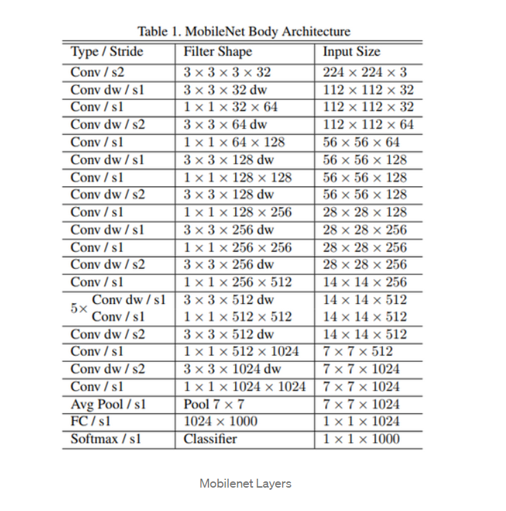
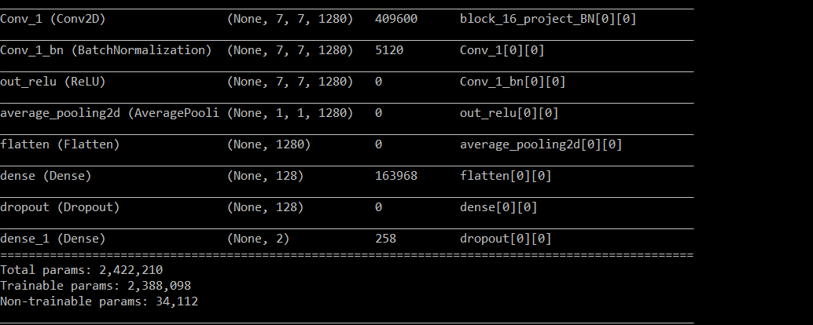

## Face-Mask-Detection

This will detect whether or not you have worn a mask or not in real time video.

# Model Summary

# First we have used a MobilenetV2 model

# What is MobileNet?

As the name applied, the MobileNet model is designed to be used in mobile applications, and it is TensorFlow’s first mobile computer vision model.

MobileNet uses depthwise separable convolutions. It significantly reduces the number of parameters when compared to the network with regular convolutions with the same depth in the nets. This results in lightweight deep neural networks.

A depthwise separable convolution is made from two operations.

- Depthwise convolution.
- Pointwise convolution.

MobileNet is a class of CNN that was open-sourced by Google, and therefore, this gives us an excellent starting point for training our classifiers that are insanely small and insanely fast.

## The Architecture of MobileNet

# The next part of the model.

